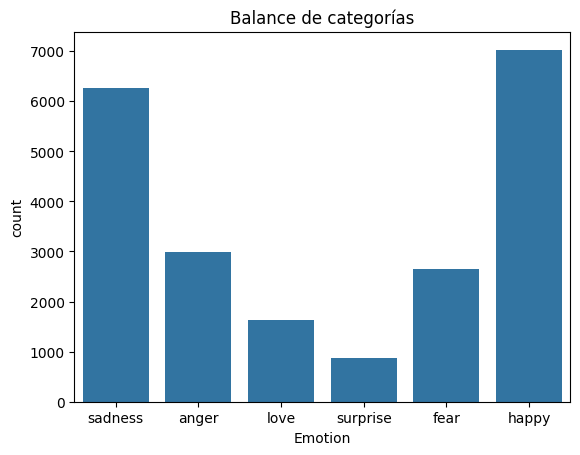
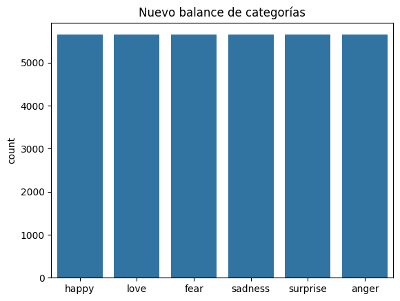

# Clasificación de emociones en comunidades chilenas de Reddit

## 1. Definición del problema

Reddit es una plataforma de red social donde el contenido y la interacción entre usuarios se basa principalmente en la narrativa escrita. A pesar de no ser tan popular como otras redes, cuenta con una comunidad activa de usuarios chilenos, destacando principalmente dos subreddits: **r/Chile** y **r/RepublicadeChile**.

Ambas comunidades poseen políticas de moderación y dinámicas ideológicas muy distintas, lo cual genera contrastes significativos. Este proyecto busca **analizar el contenido emocional** presente en estas comunidades para **identificar patrones y características relevantes**, tanto individuales como comparativas.

---

## 2. Plan de acción

Para cumplir con el objetivo, se entrenará un modelo de clasificación de textos capaz de **determinar la emoción predominante** en los posts evaluados.

### 2.1 Dataset

Se utilizará el dataset **"Emotions in Text"** de Ishant (Kaggle), que contiene aproximadamente **21.000 ejemplos únicos**, con las columnas:

- `Text`: contenido textual
- `Emotion`: etiqueta emocional (6 clases)

Este dataset fue seleccionado por su variedad textual y multiclase, lo que lo hace superior a otros que solo contemplan clasificaciones binarias como "positivo" / "negativo".

### 2.2 Modelo

El modelo seleccionado es el **clasificador Naive Bayes**, conocido por su eficiencia y efectividad en tareas de clasificación de texto multiclase.

### El plan contempla las siguientes etapas:

### 2.3 Entrenamiento del modelo

1. **Exploración y limpieza del dataset**: se evaluarán sus características, balance de clases y se realizará una limpieza (eliminación de palabras irrelevantes o sin carga emocional) y transformación del texto.
2. **Entrenamiento y evaluación**: se entrenará el modelo y se validará su rendimiento utilizando técnicas estándar de evaluación.

### 2.4 Preparación del contenido objetivo (Reddit)

1. **Extracción de posts**: se recopilarán publicaciones desde los subreddits objetivo utilizando las herramientas de Reddit o técnicas de Web Scraping.
2. **Traducción del contenido**: como el dataset está en inglés, los textos de Reddit deben traducirse. Se utilizará el modelo de traducción automática **MADLAD-3B**, ideal para mantener el contexto en múltiples idiomas.
MADLAD-3B es útil para traducciones de baja complejidad y es soportable por la máquina virtual de Google Colab utilizando la GPU-T4.
3. **Procesamiento del contenido**: se aplicará la misma limpieza y transformación usada en el dataset de entrenamiento para asegurar compatibilidad con el modelo.

### 2.5 Clasificación y análisis

1. **Clasificación de los posts**: se utilizará el modelo entrenado para predecir la emoción de cada publicación.
2. **Evaluación y conclusiones**: se analizarán los resultados para identificar tendencias emocionales y diferencias entre las comunidades.

---

## 3. Justificación del modelo

Se elige **Naive Bayes** debido a:

- Su **eficacia en problemas de alta dimensionalidad**, como el texto.
- Su capacidad **natural para clasificación multiclase**.
- Su **rapidez y bajo costo computacional**, ideal para procesamiento de grandes volúmenes de datos. especialmente considerando los actuales 21K de datos.
- Su **interpretabilidad**, útil para análisis exploratorio.

Aunque no capta matices complejos o contextos narrativos como lo haría una red neuronal, es suficientemente potente para el propósito del proyecto y representa un excelente punto de partida.

---
---
---

# Metodología

Para la metodología se realizan la siguiente serie de pasos.

---

### Instalar e importar librerías

Para el trabajo se requiere el uso de variadas librerías, entre ellas las más notables:

- **`sklearn`**: para todo lo relacionado a clasificadores y herramientas de vectorización.  
- **`imblearn`**: para sobremuestreo con SMOTE.  
- **`numpy`** y **`pandas`**: para la manipulación del set de datos.  
- **`re`**: para el procesamiento de texto.

---

### Importar, explorar y procesar el dataset

El contenido del dataset es texto en bruto, por lo que requiere de limpieza y transformación para poder ser utilizado en cualquier modelo de clasificación, como lo es **Multinomial Naive Bayes**.

El dataset, con un total de **21.459 filas**, contiene dos columnas:

- `Text`: El texto en bruto.  
- `Emotion`: La emoción predominante (`sadness`, `anger`, `love`, `surprise`, `fear`, `happy`).  

Ninguna de las columnas contiene valores nulos o vacíos.

Posteriormente, se realiza un **countplot** para visualizar el balance de las categorías del dataset.

---

### Procesamiento del dataset

Es necesario simplificar el texto, mantener solamente las palabras más **expresivas**, eliminando aquellas que sean irrelevantes: caracteres, signos, menciones, links/URLs y otro tipo de contenido basura, para mejorar el rendimiento final.

Se aplican los siguientes pasos:

1. Eliminar enlaces, menciones, hashtags (en caso de existir) y caracteres especiales.  
2. Eliminar las *stopwords* determinadas y aplicar *stemming* para convertir las restantes a su forma raíz.  
3. Reensamblar y guardar el texto procesado.  
4. Añadir una nueva columna llamada `"Target"` para almacenar el valor numérico correspondiente a cada categoría en `"Emotion"`.

Con este preprocesamiento, el dataset resultante es más limpio y óptimo para su posterior vectorización.

---

### División del dataset y vectorización

Ahora que se posee un dataset limpio, se procede a **vectorizar** con el fin de generar una entrada válida para el clasificador Naive Bayes.

Se utiliza el vectorizador **`TfidfVectorizer`**, ya que este considera el contexto estadístico de las palabras dentro del corpus, en lugar de simplemente contar las apariciones como lo hace `CountVectorizer`.

El dataset es dividido, y los sets de entrenamiento y prueba son vectorizados.

> Fuente: [How can we use TFIDF vectors with multinomial naive bayes?](https://stackoverflow.com/questions/43237286/how-can-we-use-tfidf-vectors-with-multinomial-naive-bayes)

---

### Sobremuestreo

A fin de equilibrar el conjunto de datos, se **sobremuestrean las clases minoritarias** mediante la creación de muestras sintéticas a partir de las existentes, utilizando **SMOTE (Synthetic Minority Oversampling Technique)**.

> Fuente: [Handling Imbalanced Datasets in scikit-learn: Techniques and Best Practices](https://datasciencehorizons.com/handling-imbalanced-datasets-in-scikit-learn-techniques-and-best-practices/)

Para aplicar SMOTE, el set de entrenamiento se convierte a un array, ya que es el formato requerido.

- Tamaño original del set de entrenamiento: **17.167** muestras (80%)  
- Tamaño posterior al sobremuestreo: **33.888** muestras

---

### Evaluar rendimiento con Cross Validation

Con el set de datos ya procesado, vectorizado y reequilibrado, se procede a evaluar el rendimiento del clasificador **Multinomial Naive Bayes** utilizando validación cruzada (**Cross Validation**).

---

### Predicciones finales

Se realizan las predicciones finales del modelo **Multinomial Naive Bayes** sobre el set de prueba.

---

### Reducción de dimensionalidad

Se aplica la técnica de **mutual information** para reducir la dimensionalidad del espacio de características, pasando de **10.000 features** a **5.000** más relevantes.

Luego, se realiza nuevamente la vectorización del set de entrenamiento usando únicamente estas features, y se evalúa el nuevo rendimiento del modelo.

---

### Evaluación con Bagging Classifier

Finalmente, se evalúa un modelo clasificador basado en **Bagging** con `MultinomialNB`, con el objetivo de observar posibles mejoras en el rendimiento general.

---
---
---

# Resultados Obtenidos

Antes de llegar a esta metodología de trabajo, se intentó realizar las clasificaciones con:

1. CountVectorizer
2. TfidfVectorizer
3. TfidfVectorizer + SMOTE

Con el fin de lograr el mejor rendimiento, obteniendo así los sigueintes resultados:

#### Resultados *CountVectorizer* 

##### Del cross validate
f1 prom:  0.7281401033099608
Accuracy prom:  0.7502185212639733

##### Del modelo entrenado

                   precision    recall  f1-score   support

         sadness       0.77      0.91      0.84      1277
           anger       0.87      0.71      0.78       617
            love       0.78      0.36      0.50       318
        surprise       0.68      0.19      0.30       168
            fear       0.81      0.65      0.72       531
           happy       0.76      0.91      0.83      1381

        accuracy                           0.78      4292
       macro avg       0.78      0.62      0.66      4292
    weighted avg       0.78      0.78      0.76      4292

#### Resultados *TfidfVectorizer*

##### Del cross validate
f1 prom:  0.5664388039206901
Accuracy prom:  0.6415799920855612

##### Del modelo entrenado

                   precision    recall  f1-score   support

         sadness       0.68      0.92      0.78      1277
           anger       0.96      0.29      0.45       617
            love       1.00      0.07      0.13       318
        surprise       1.00      0.01      0.01       168
            fear       0.90      0.24      0.38       531
           happy       0.61      0.97      0.75      1381

        accuracy                           0.66      4292
       macro avg       0.86      0.42      0.42      4292
    weighted avg       0.76      0.66      0.60      4292

#### FINAL: Resultados *TfidfVectorizer + SMOTE sobremuestreo* 

##### Del cross validate
f1 prom:  0.902898308321791
Accuracy prom:  0.9039187913125591

##### Del modelo entrenado

                   precision    recall  f1-score   support

         sadness       0.88      0.87      0.87      1277
           anger       0.84      0.80      0.82       617
            love       0.59      0.78      0.67       318
        surprise       0.54      0.73      0.62       168
            fear       0.81      0.78      0.80       531
           happy       0.87      0.82      0.84      1381

        accuracy                           0.82      4292
       macro avg       0.76      0.80      0.77      4292
    weighted avg       0.83      0.82      0.82      4292

---

### Balances

El balance original del dataset es:

Luego del Sobremuestreo, el balance resultante es:

---
---
---

# Conclusiones

Luego de realizar los procesos de probar alternativas para lograr un mejor rendimiento, se determinó que el uso de TfidfVectorizer es mejor que CountVectorizer. Esto se debe a que TfidfVectorizer no solo toma en cuenta la frecuencia de las palabras, sino que las pondera, y por tanto diferencia su importancia, dependiendo de la rareza e impacto que tienen estas para cada una de las categorías.

El uso de SMOTE fue el que realmente ayudó en la mejora del rendimiento, puesto que el desbalance del dataset era el principal obstáculo a la hora de realizar un buen entrenamiento. La creación de nuevas muestras sintéticas a partir de las existentes ayudó mucho en este aspecto. Si bien duplicó el set de entrenamiento y por tanto afectó el rendimiento, mejoró óptimamente el rendimiento de los resultados.
